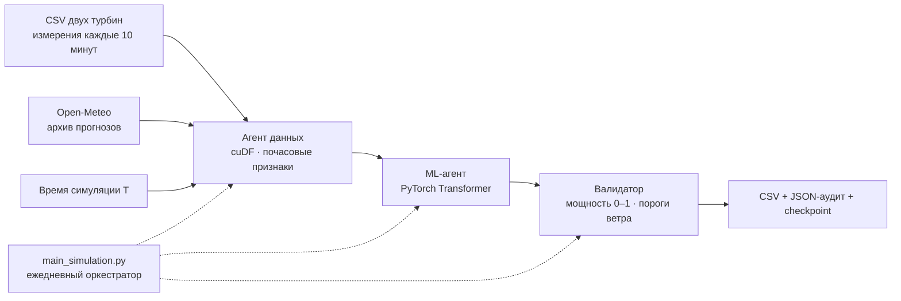

# ALEM WIND

**Почасовой прогноз мощности ветроэлектростанции на 24–48 часов.**

HackAlem AI · трек 01 «Энергетика» · кейс Самрук-Казына.

Стартовый прототип: три программных агента готовят данные, обучают совместную модель двух турбин и проверяют физические ограничения. Оркестратор воспроизводит ежедневные прогнозы за 1–28 февраля 2026 года. Здесь есть Python-пайплайн, тесты и интерактивный макет интерфейса. Это первый инженерный baseline; качество прогноза на скрытом феврале ещё не измерено.

## Проверенные результаты CPU и NVIDIA L4

**Проверка выполнена 23.09.2026.** В репозиторий включены реальные результаты, а не только описание успешного запуска. Быстрая проверка без GPU, сети и сторонних Python-пакетов:

```bash
python verify_results.py
```

Команда сверяет SHA-256, дневные CSV и общий submission, наличие checkpoints, временные границы в аудите, размер выборок и самостоятельно пересчитывает MAE/RMSE из сохранённых прогнозов и наблюдений. Она **не запускает CUDA повторно** и не подтверждает достоверность исходных измерений без исходных CSV. Ссылки на доказательства:

| Проверка | Артефакт |
| --- | --- |
| Исходный CPU-прогноз 30 января, сохранён без изменения | [backtest](outputs/backtest/) |
| Повтор CPU-прогноза и оценка | [replay](outputs/replay/) |
| 14 ежедневных CPU-обучений и прогнозов | [rolling-january](outputs/rolling-january/) |
| Паритет CPU/GPU с одинаковыми весами и отдельное CUDA-обучение | [verification.json](outputs/gpu-check/verification.json), [полный лог](outputs/evidence/gpu-verification.txt) |
| 14 ежедневных CUDA/cuML-обучений и прогнозов | [rolling-january-gpu](outputs/rolling-january-gpu/), [лог](outputs/evidence/gpu-rolling.txt) |
| Реальный GPU и установленная среда | [nvidia-smi](outputs/evidence/gpu-nvidia-smi.txt), [версии](outputs/evidence/gpu-environment.json), [Conda export](outputs/evidence/gpu-conda-explicit.txt) |
| Исходная CPU/UI-проверка и тесты на L4 | [CPU/UI](outputs/evidence/cpu-verification.txt), [GPU tests](outputs/evidence/gpu-tests.txt) |
| Хеши результатов, исполнявшегося кода и исходных CSV | [manifest.json](outputs/evidence/manifest.json) |
| Научный отчёт по GPU-выпуску 29 января: 6 рисунков и 48 фактических турбино-часов | [PDF](outputs/evidence/gpu-report-20260129.pdf), [HTML, рисунки, CSV и аудит в ZIP](outputs/evidence/gpu-report-20260129.zip) |

### Протокол оценки

Горизонт **24 часа**, история **72 часа**, **14** суточных обучающих примеров, **10 эпох**, seed **42**, совместный Transformer двух турбин. Настройки одинаковы на всех датах; политика `expanding` ежедневно переобучает модель только на доступных до выпуска наблюдениях. Development: **16–24 января** (9 выпусков); holdout: **25–29 января** (5 выпусков). Граница была выбрана до расчёта этих метрик; отдельной внешней регистрации протокола нет. Уже просмотренное 30 января не включено в holdout.

В каждом rolling-запуске **672/672** сопоставленных турбино-часа, исключено **0**; holdout содержит по **120 часов на турбину**. Все методы оцениваются на одинаковых часах. Persistence — значение последнего наблюдаемого часа перед выпуском, фиксированное на весь горизонт. MAE = mean(|прогноз − факт|), RMSE = sqrt(mean((прогноз − факт)²)); единица p.u.

| Выборка / метод | T1 MAE | T1 RMSE | T2 MAE | T2 RMSE |
| --- | ---: | ---: | ---: | ---: |
| Development · Transformer CPU | 0.285952 | 0.365977 | 0.281505 | 0.367128 |
| Development · Transformer L4 | 0.286086 | 0.366257 | 0.281391 | 0.368497 |
| Development · persistence | 0.336921 | 0.481892 | 0.322454 | 0.465179 |
| Development · кривая мощности | 0.357655 | 0.506047 | 0.342951 | 0.492558 |
| Holdout · Transformer CPU | 0.341337 | 0.386011 | 0.367809 | 0.406868 |
| Holdout · Transformer L4 | 0.345368 | 0.390735 | 0.366877 | 0.406949 |
| Holdout · persistence | 0.440778 | 0.563261 | 0.455472 | 0.580702 |
| Holdout · кривая мощности | 0.288436 | 0.431351 | 0.290770 | 0.437501 |
| 30 января · Transformer CPU | 0.382481 | 0.434209 | 0.314678 | 0.356434 |
| 30 января · Transformer L4 | 0.380936 | 0.432263 | 0.323644 | 0.365402 |
| 30 января · persistence | 0.280556 | 0.364332 | 0.267569 | 0.357635 |
| 30 января · кривая мощности | 0.709259 | 0.746397 | 0.722245 | 0.760259 |

На этом holdout Transformer лучше persistence по MAE/RMSE обеих турбин. Однако простая кривая мощности лучше Transformer по **MAE holdout**, а 30 января модель проигрывает persistence по MAE. Поэтому превосходство над всеми baselines не заявляется. Кривая использует некалиброванный ветер 10 м и не является паспортной характеристикой ВЭУ. Все значения, включая эту кривую и метрики каждого lead, сохранены в `evaluation.json`/`evaluation.csv`; [сопоставленные GPU-строки](outputs/rolling-january-gpu/evaluation-hours.csv) доступны отдельно.

### Что подтвердил GPU-тест

NVIDIA L4 в Brev/GCP, драйвер **595.91.07**, PyTorch **2.13.0+cu126**, CUDA runtime **12.6**, cuDF/cuML **25.10**, CuPy **14.2.0**, Python **3.11.16**. Проверены обработка обоих полных CSV через cuDF, нормализация cuML, размещение модели на CUDA и обучение с AMP.

```text
Ran 42 tests in 3.621s
OK (skipped=1)
PASS: pandas/cudf hourly features and missing-value masks match
PASS: same-checkpoint CPU/cuda inference; max difference=3.8743019e-06
PASS: cuda training and evaluation completed, 48 rows
PASS: 14 CUDA/cuML training origins and 672 evaluated turbine-hours
```

На L4 пропущен только тест поведения при **отсутствии** CUDA. Набор из 42 тестов относится к версии прогнозного пайплайна до объединения с модулем научных отчётов; полный объединённый набор проверен отдельно: **53 Python-теста, OK**, плюс **9 тестов отчётного UI** и проверка отображения оценок; [лог Python](outputs/evidence/current-tests.txt). Эти проверки настроены в CI, но [запуск для коммита с результатами](https://github.com/BAITC-Hacks/hack-c9937c44-xy/actions/runs/35857894628) не начался: GitHub сообщил о блокировке аккаунта из-за billing issue. Успешная облачная проверка не заявляется; приведённые выше 53 теста выполнены локально. Числовой паритет использует один CPU-checkpoint и допуск `rtol=atol=1e-4`; повторное обучение с AMP и другой версией PyTorch не обязано давать те же веса или прогнозы. Превосходство GPU по скорости не измерялось. Инстанс удалён после скачивания результатов; повторный запуск потребует нового доступа к GPU.

### Независимая перепроверка и воспроизведение

В Git опубликованы погода, прогнозы, аудит и checkpoints пяти зафиксированных запусков. Полные исходные SCADA остаются в `data/raw/` вне Git; проверяющему нужны два CSV организатора с именами и SHA-256 из `manifest.json`. [observations.csv](outputs/observations.csv) — 720 уникальных почасовых фактов для опубликованных дат, полученных из этих CSV, без интерполяции. Он используется только для оценки и научных рисунков.

С оригинальными данными можно повторно вычислить наблюдения, persistence и метрики, а не доверять сохранённым фактам:

```bash
python -m pip install -r requirements.txt
python verify_results.py --data-dir data/raw
python -m unittest discover -s tests -q
node tests/test_preview.cjs
node tests/report-ui.test.cjs
```

SHA-256 обнаруживает изменение зафиксированных файлов, но сам по себе не является внешней аттестацией эксперимента. [cpu-verification.txt](outputs/evidence/cpu-verification.txt) — исторический лог **до** GPU-проверки; его строка «GPU not tested» описывает состояние на тот момент.

Воспроизведение одной даты без новых погодных запросов (новая папка обязательна):

```bash
python gpu_check.py --cpu-rehearsal --output outputs/recheck-cpu
# В настроенной среде NVIDIA, без --cpu-rehearsal:
python gpu_check.py --output outputs/recheck-gpu
```

Для повторения проверенного Linux x86_64 окружения используйте установленный Miniforge/Conda и драйвер NVIDIA, совместимый с CUDA 12.6:

```bash
conda create -y --prefix .gpu-env --file outputs/evidence/gpu-conda-explicit.txt
conda activate "$PWD/.gpu-env"
export LD_LIBRARY_PATH="$CONDA_PREFIX/lib${LD_LIBRARY_PATH:+:$LD_LIBRARY_PATH}"
python -m pip install torch==2.13.0 --index-url https://download.pytorch.org/whl/cu126
python gpu_check.py --output outputs/recheck-gpu
```

Conda export фиксирует нативные библиотеки, pandas 2.3.3 и scikit-learn 1.7.2. `gpu-packages.txt` — диагностический `pip freeze`, **не** переносимый requirements-файл: в нём есть пути сборки Conda. RAPIDS 26.08 требует pandas 3; cuML 25.10 не импортировался со scikit-learn 1.9.1. Переменная `LD_LIBRARY_PATH` нужна проверенной среде, чтобы PyTorch не загрузил старую системную библиотеку C++ перед RAPIDS. Это команды восстановления окружения, не команда аренды машины.

Повтор rolling-эксперимента на CPU; для L4 замените `pandas/cpu` на `cudf/cuda` и используйте другую новую папку:

```bash
python main_simulation.py --data-dir data/raw --data-timezone UTC --history-policy expanding --backend pandas --device cpu --start 2026-01-16 --end 2026-01-29 --horizon 24 --lookback 72 --train-days 14 --min-train-samples 14 --epochs 10 --seed 42 --output outputs/recheck-rolling
python evaluate.py --forecasts outputs/recheck-rolling --turbine-1 "data/raw/Dataset HackAlemAI для участников 11.03.2023-28.02.2026 - turbine 1.csv" --turbine-2 "data/raw/Dataset HackAlemAI для участников 11.03.2023-28.02.2026 - turbine 2.csv" --data-timezone UTC --holdout-start 2026-01-25T00:00:00Z
```

Фактические GPU-запуски выполнялись с выключенным TF32 и запретом сетевых запросов `requests`; использован опубликованный погодный кеш. Для точного повторения этого режима перед `run(args)` задайте `torch.backends.cuda.matmul.allow_tf32 = False`, `torch.backends.cudnn.allow_tf32 = False` и запретите `requests.sessions.Session.request`, как в `gpu_check.py`.

**Пределы вывода:** подтверждена работоспособность пайплайна и согласованность конкретных артефактов. Holdout — лишь пять соседних дней, турбины и часы зависимы; статистическая значимость, переносимость на другие сезоны и доверительные интервалы не оценены. UTC, координаты, высоты и задержка SCADA не подтверждены. Восьмичасовой погодный lag — допущение, а не журнал фактической публикации. Точность скрытого февраля, CFD/Modulus и соответствие IEC/ГОСТ не доказаны.

## Как выглядит программа

[Исходник макета](preview/index.html) · [Код интерфейса](preview/)

```bash
python -m pip install -r requirements-reports.txt
python serve_preview.py --port 8767
```

Откройте **http://127.0.0.1:8767/preview/**. Локальный сервер показывает интерфейс, читает опубликованные запуски в `outputs/` и формирует научные отчёты. Сборка и JavaScript-зависимости не нужны.

Главный экран использует карту-схему: две выбираемые турбины, переключатель мощности/ветра и почасовая лента с воспроизведением. Выбор часа синхронизирован с графиками и таблицей. Работают дата выпуска, горизонт 24/48 часов, фильтр турбин и выгрузка CSV. Карта — условная схема, а не настоящая топография или погодный слой.

Источник «Демо интерфейса» генерирует синтетический сценарий в браузере. «Python демо» читает CSV и JSON из `outputs/demo/`; «Прогноз модели» — из `outputs/backtest/`. Для GPU-эксперимента откройте `http://127.0.0.1:8767/preview/?run=rolling-january-gpu` и выберите выпуск из manifest; на графике есть факт и persistence. Обучение из браузера пока не запускается; при отсутствии файла показывается ошибка. В режиме модели пороги ротора не применяются к ветру на 10 м.

Актуальные команды, результаты и план продолжения: [HANDOFF.md](HANDOFF.md). Дополнительные снимки исходников находятся в `handoff/`.

## Научные отчёты

В разделе **«Научные отчёты» → «Сформировать отчёт»** создаётся PDF с методикой и четырьмя научными рисунками: почасовыми траекториями, рабочими точками P(v), кривыми обеспеченности и часовыми изменениями мощности. Доступны автономный HTML, SVG, PNG 300 dpi и ZIP с данными и контрольными суммами. Отчёт охватывает обе турбины и выбранные дату, источник и горизонт.

При наличии `outputs/observations.csv` для модельного прогноза добавляются сопоставление с фактом, распределение ошибок и MAE/RMSE/bias. Без факта показатели качества остаются недоступными. Формат наблюдений, методика и CLI: [SCIENTIFIC_REPORTS.md](SCIENTIFIC_REPORTS.md). Раздел проверен с браузерным демо и артефактами Python.

В отчёты включена [нормативная основа ВЭС](STANDARDS.md): ГОСТ 7.32-2017 для структуры отчёта о НИР и IEC 61400-12-1:2022 с COR1:2025 для измерения характеристик ВЭУ. Полный шаблон НИР и измерительные испытания пока не реализованы; соответствие стандартам не заявляется. Профиль и официальные ссылки доступны в интерфейсе, PDF/HTML и JSON-аудите. После этих изменений весь набор — **52 теста, OK**.

## Архитектура



| Модуль | Реализация |
| --- | --- |
| `data_agent.py` | Русские заголовки CSV, агрегация и rolling через cuDF, явный CPU-backend, прогнозы Open-Meteo, проверяемый кеш |
| `model_agent.py` | Совместный encoder–decoder Transformer, CUDA AMP, AdamW, cuML StandardScaler по обучающим входам на GPU, сохранение модели |
| `validator_agent.py` | Ограничения мощности и ветра, явная точка расширения для Modulus |
| `main_simulation.py` | Календарь симуляции, проверка доступности данных, обучение/инференс, ежедневные файлы и общий `submission.csv` |
| `main.py` | Совместимый вход для прежних команд запуска |
| `evaluate.py` | Оценка завершённого запуска по позднее полученным SCADA: MAE/RMSE модели, persistence и простой кривой мощности |
| `preview/` | Статическая панель просмотра CSV/JSON, выбор источника, даты и горизонта |
| `tests/` | Проверки причинности, полноты данных, кеша, модели, физики и ежедневного цикла |

Агенты здесь — специализированные исполняемые модули, управляемые детерминированным оркестратором. LLM/NIM не участвует в численном прогнозе. TFT, GNN и модель потоков Modulus пока не реализованы; выбран Transformer как проверяемая начальная архитектура. cuDF выполняет агрегацию и rolling на GPU, cuML — нормализацию входов модели. Небольшие таблицы погоды, часовые пояса и метаданные обрабатываются на CPU.

Публичные функции: `fetch_weather_forecast(lat, lon, current_date)` в `data_agent.py`, `train_model(TrainingData, config)` и `predict(model, ForecastData)` в `model_agent.py`, `validate_power(power, wind)` в `validator_agent.py`. Контракты обучения и прогноза содержат временные метки доступности погоды; функции проверяют их до обращения к модели.

## Данные и единицы

CSV содержат время, среднюю скорость ветра, нормализованную активную мощность и температуру. Пути передаются аргументами; полные исходные CSV исключены из Git. Погодный кеш и зафиксированные результаты с весами опубликованы для проверки; новые эксперименты остаются локальными.

Проверка реальных файлов обнаружила:

| Источник | Строк по 10 минут | Полных часов до 01.02.2026, при интерпретации UTC |
| --- | ---: | ---: |
| Турбина 1 | 142 360 | 23 667 |
| Турбина 2 | 149 499 | 24 785 |

Оба файла фактически заканчиваются **31.01.2026 23:50**, хотя названия упоминают 28.02.2026. Февральских измерений в них нет. В непрерывной почасовой сетке 25 392 интервала; пропуски сохраняются.

Почасовая мощность — среднее шести уникальных десятиминутных измерений. Это **нормализованная средняя мощность (p.u.)**, а не сумма и не энергия в МВт·ч. Для энергии нужна номинальная мощность турбины. Неполные часы и окна не заполняются будущими значениями. Конфликтующие дубликаты отклоняются.

Временная метка считается началом измерительного интервала. Часовой пояс CSV не указан в материалах, поэтому реальный запуск требует `--data-timezone`. Координаты взяты из запроса: T1 `(51.04, 71.46)`, T2 `(51.05, 71.45)`. Перед финальной оценкой нужно сверить координаты, часовой пояс и соглашение о метках с владельцем данных.

## Защита от утечки

1. Сырые наблюдения отсекаются по `timestamp < T` до численного преобразования, агрегации и rolling. Используются только полностью завершённые часы.
2. У обучающей последовательности история `[s−lookback, s)` и целевые часы `[s, s+horizon)`. Последний целевой час строго раньше обучающего cutoff.
3. Будущие погодные признаки для обучающего примера запрашиваются **на момент s**, а для прогноза — на момент T. Фактическая погода не подставляется в decoder.
4. Нормализация обучается только на обучающих массивах. Внутренней случайной validation-разбивки нет; число эпох фиксировано. Train loss не считается оценкой качества backtest.
5. Отсутствующий прогноз, неверные единицы, NaN и несовпадение времён останавливают расчёт. Автоматической замены на ERA5, reanalysis или live forecast нет.
6. Кеш включает источник, модель, координаты, горизонт, cutoff, политику доступности и контрольную сумму ответа.

Обычный [Historical Forecast API](https://open-meteo.com/en/docs/historical-forecast-api) склеивает первые часы последовательных запусков. Для будущих признаков такого ряда недостаточно. Начальный адаптер использует [Previous Runs API](https://open-meteo.com/en/docs/previous-runs-api), модель `gfs_global`, переменные с суффиксом `_previous_dayN`.

Для каждого прогнозируемого часа `v` выбирается упреждение:

```text
N = max(1, ceil((v − T + publication_lag) / 24 часов))
issued_at_upper_bound = v − N × 24 часа
available_at_upper_bound = issued_at_upper_bound + publication_lag
available_at_upper_bound ≤ T
```

По умолчанию `publication_lag = 8 часов`. Это консервативное предположение о публикации, **не подтверждённый журнал фактического времени выдачи**. Адаптер сохраняет вычисленные верхние границы, не выдавая их за точный `run_id`. Для окончательного доказательства доступности каждого исходного прогноза потребуется архив запусков с подтверждённым временем публикации. [Single Runs API](https://open-meteo.com/en/docs/single-runs-api) позволяет выбирать запуск, но доступность модели и происхождение архива нужно проверять отдельно.

## Два режима истории

**`--history-policy frozen` — явный режим для приложенных январских CSV.** История и обучение фиксируются на первом моменте симуляции. Модель обучается один раз, затем ежедневно получает новый архивный погодный прогноз. Февральская мощность не выдумывается и не требуется. В JSON записываются `context_origin` и возраст контекста. Устаревание истории к концу месяца может ухудшать точность: это ограничение baseline, а не доказанная модель месячного горизонта.

**`--history-policy expanding` — по умолчанию.** На каждой дате модель заново обучается на уже доступных наблюдениях. Нужны новые фактические SCADA-измерения до текущего T. С приложенными файлами этот режим не сможет продолжить расчёт после 1 февраля: неполная история вызывает явную ошибку. До запуска на весь месяц добавьте новые наблюдения либо явно выберите `frozen`.

## Быстрый запуск без GPU и сети

Python 3.11+:

```bash
python -m venv .venv
# Linux / WSL2:
source .venv/bin/activate
# Windows PowerShell: .venv\Scripts\Activate.ps1
python -m pip install -r requirements-demo.txt
python main_simulation.py --demo
```

Получите **28 дневных CSV и 28 JSON-аудитов** в `outputs/demo/`, а также `run.json` и общий `submission.csv`. При горизонте 48 часов каждый дневной CSV содержит 96 строк: 48 часов × 2 турбины; весь месяц — 2 688 строк. Последний прогноз сохраняет часы вплоть до 01.03.2026 23:00 UTC. Это демонстрация контракта вывода; она не обучает модель и не является конкурсной отправкой.

## Запуск модели

Установите совместимые PyTorch, cuDF, cuML и CuPy в окружении NVIDIA-кластера. RAPIDS требует Linux либо Windows через WSL2; версию CUDA и RAPIDS выбирайте по [официальному установщику](https://docs.rapids.ai/install/). `requirements.txt` не устанавливает RAPIDS автоматически, чтобы не навязать несовместимый CUDA wheel. На CUDA нормализация по умолчанию требует cuML; CPU-проверки используют NumPy без scikit-learn.

```bash
python -m pip install -r requirements.txt
python -c "import cudf, cuml, cupy, torch; print(cudf.__version__, cuml.__version__, torch.__version__); assert torch.cuda.is_available()"
```

Пример для CSV, **часовой пояс которых подтверждён как UTC**:

```bash
python main_simulation.py --data-dir "data/raw" --data-timezone UTC --history-policy frozen --backend cudf --device cuda --start 2026-02-01 --end 2026-02-28 --horizon 48
```

В `--data-dir` ожидаются оба исходных файла с точными русскими именами из задания. Можно передать другие пути явно через `--turbine-1` и `--turbine-2`.

Если метки локальные, укажите подтверждённый IANA timezone вместо UTC. `--simulation-timezone` задаёт часовой пояс ежедневного момента выпуска; по умолчанию это 00:00 UTC. Чтобы дополнительно воспроизвести выпуск 31 января, задайте `--start 2026-01-31` — тогда и заморозка истории начнётся на сутки раньше.

Для CPU-проверки доступны `--backend pandas --device cpu`. Смена устройства выполняется явно. По умолчанию используются 72 часа контекста, 90 дней для выбора обучающих примеров, минимум 14 полных суточных примеров и 10 эпох. Первый запуск скачивает погоду для обучающих дат, последующие используют кеш. Неполные исторические окна исключаются; их число отражается в аудите.

Физические правила: `0 ≤ power ≤ 1`. В реальном пайплайне обнуление по ветровым порогам отключено: прогноз на **10 м** нельзя непосредственно применять к порогам ротора неизвестной высоты. Аудит сохраняет `wind_limits_applied: false`. Деморежим использует иллюстративные пороги 3/25 м/с. Пересчёт на высоту ротора и калибровка требуют подтверждённых данных. Плотность воздуха рассчитывается приближённо как `P × 100 / (287.05 × (T°C + 273.15))`.

## Результаты и воспроизводимость

```text
outputs/backtest/
├── run.json
├── submission.csv
├── forecast_20260201T0000Z.csv
├── forecast_20260201T0000Z.json
├── ...
└── checkpoints/
    └── model_20260201T0000Z.pt
```

CSV: `forecast_origin, valid_time, turbine_id, power_normalized, wind_speed_ms`. Общий файл обновляется атомарно после каждого дня только из результатов текущего запуска; повторный запуск не дописывает дубликаты. `run.json` сообщает `running`, `completed` или `failed`; неполный результат нельзя считать завершённым submission.

JSON содержит режим, границу наблюдений, даты обучающих примеров, ограничения доступности погоды, физическую проверку и путь к весам. Checkpoint хранит конфигурацию, нормализацию и веса. Разные даты выпуска могут прогнозировать один час — это разные прогнозы; склеивать их без учёта `forecast_origin` нельзя. CSV-контракт нужно сверить с форматом финального submission организаторов.

```bash
python -m unittest discover -s tests -v
python main_simulation.py --demo --start 2026-02-28 --end 2026-02-28 --horizon 48
```

Результаты CPU, NVIDIA L4 и ссылки на логи приведены в разделе «Проверенные результаты CPU и NVIDIA L4» выше. Для полного набора модельных тестов нужен PyTorch; пропуски при его отсутствии не означают проверку модели.

`evaluate.py` принимает только завершённые запуски с актуальным `run.json` и оценивает перечисленные в нём дневные файлы. Для прежних результатов без статуса завершения нужно повторить запуск. Пропуски исключаются из общих масок сравнения и явно подсчитываются; отсутствие наблюдений не превращается в нулевую ошибку.

## Следующий этап

- Подтвердить координаты, timezone, момент доступности SCADA и высоту ступицы.
- Расширить проверку за пределы пятидневного holdout, сохранив опубликованный эксперимент без изменения.
- Проверить горизонт 48 часов и устойчивость к пропускам/задержкам SCADA на отдельных временных отрезках.
- Сопоставить замороженный контекст с weather-only моделью, масками отсутствующей истории и TFT/GNN.
- Добавлять Modulus после получения рельефа и геометрии, с измеримой проверкой полезности физических признаков.
