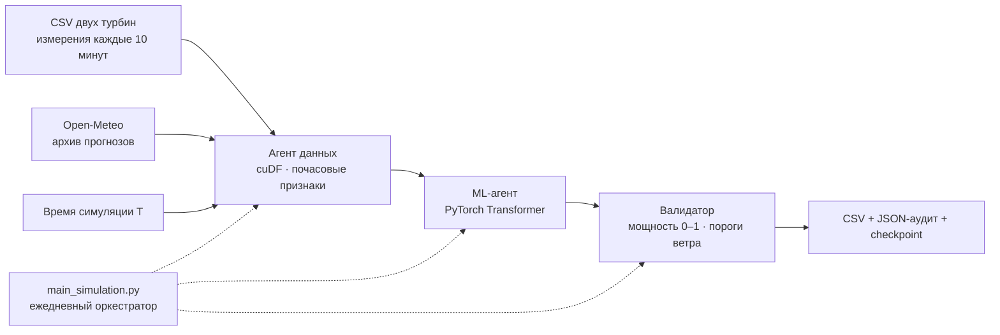

# ALEM WIND

**Почасовой прогноз мощности ветроэлектростанции на 24–48 часов.**

HackAlem AI · трек 01 «Энергетика» · кейс Самрук-Казына.

Стартовый прототип: три программных агента готовят данные, обучают совместную модель двух турбин и проверяют физические ограничения. Оркестратор воспроизводит ежедневные прогнозы за 1–28 февраля 2026 года. Здесь есть Python-пайплайн, тесты и интерактивный макет интерфейса. Это первый инженерный baseline; качество прогноза на скрытом феврале ещё не измерено.

## Как выглядит программа

[Исходник макета](preview/index.html) · [Код интерфейса](preview/)

```bash
python -m pip install -r requirements-reports.txt
python serve_preview.py --port 8767
```

Откройте **http://127.0.0.1:8767/preview/**. Локальный сервер показывает интерфейс, читает `outputs/demo/` и `outputs/backtest/` и формирует научные отчёты. Сборка и JavaScript-зависимости не нужны.

Главный экран использует карту-схему: две выбираемые турбины, переключатель мощности/ветра и почасовая лента с воспроизведением. Выбор часа синхронизирован с графиками и таблицей. Работают дата выпуска, горизонт 24/48 часов, фильтр турбин и выгрузка CSV. Карта — условная схема, а не настоящая топография или погодный слой.

Источник «Демо интерфейса» генерирует синтетический сценарий в браузере. «Python демо» читает CSV и JSON из `outputs/demo/`; «Прогноз модели» — из `outputs/backtest/`. Для готового январского теста выберите 30.01.2026, 24 часа. Обучение из браузера пока не запускается; при отсутствии файла показывается ошибка. В режиме модели пороги ротора не применяются к ветру на 10 м.

Актуальные команды, результаты и план продолжения: [HANDOFF.md](HANDOFF.md). Дополнительные снимки исходников находятся в `handoff/`.

## Научные отчёты

В разделе **«Научные отчёты» → «Сформировать отчёт»** создаётся PDF с методикой и четырьмя научными рисунками: почасовыми траекториями, рабочими точками P(v), кривыми обеспеченности и часовыми изменениями мощности. Доступны автономный HTML, SVG, PNG 300 dpi и ZIP с данными и контрольными суммами. Отчёт охватывает обе турбины и выбранные дату, источник и горизонт.

При наличии `outputs/observations.csv` для модельного прогноза добавляются сопоставление с фактом, распределение ошибок и MAE/RMSE/bias. Без факта показатели качества остаются недоступными. Формат наблюдений, методика и CLI: [SCIENTIFIC_REPORTS.md](SCIENTIFIC_REPORTS.md). Раздел проверен с браузерным демо и артефактами Python.

В отчёты включена [нормативная основа ВЭС](STANDARDS.md): ГОСТ 7.32-2017 для структуры отчёта о НИР и IEC 61400-12-1:2022 с COR1:2025 для измерения характеристик ВЭУ. Полный шаблон НИР и измерительные испытания пока не реализованы; соответствие стандартам не заявляется. Профиль и официальные ссылки доступны в интерфейсе, PDF/HTML и JSON-аудите. После этих изменений весь набор — **52 теста, OK**.

## Архитектура



| Модуль | Реализация |
| --- | --- |
| `data_agent.py` | Русские заголовки CSV, агрегация и rolling через cuDF, явный CPU-backend, прогнозы Open-Meteo, проверяемый кеш |
| `model_agent.py` | Совместный encoder–decoder Transformer, CUDA AMP, AdamW, cuML StandardScaler по обучающим входам на GPU, сохранение модели |
| `validator_agent.py` | Ограничения мощности и ветра, явная точка расширения для Modulus |
| `main_simulation.py` | Календарь симуляции, проверка доступности данных, обучение/инференс, ежедневные файлы и общий `submission.csv` |
| `main.py` | Совместимый вход для прежних команд запуска |
| `evaluate.py` | Оценка завершённого запуска по позднее полученным SCADA: MAE/RMSE модели, persistence и простой кривой мощности |
| `preview/` | Статическая панель просмотра CSV/JSON, выбор источника, даты и горизонта |
| `tests/` | Проверки причинности, полноты данных, кеша, модели, физики и ежедневного цикла |

Агенты здесь — специализированные исполняемые модули, управляемые детерминированным оркестратором. LLM/NIM не участвует в численном прогнозе. TFT, GNN и модель потоков Modulus пока не реализованы; выбран Transformer как проверяемая начальная архитектура. cuDF выполняет агрегацию и rolling на GPU, cuML — нормализацию входов модели. Небольшие таблицы погоды, часовые пояса и метаданные обрабатываются на CPU.

Публичные функции: `fetch_weather_forecast(lat, lon, current_date)` в `data_agent.py`, `train_model(TrainingData, config)` и `predict(model, ForecastData)` в `model_agent.py`, `validate_power(power, wind)` в `validator_agent.py`. Контракты обучения и прогноза содержат временные метки доступности погоды; функции проверяют их до обращения к модели.

## Данные и единицы

CSV содержат время, среднюю скорость ветра, нормализованную активную мощность и температуру. Пути передаются аргументами; исходные материалы, кеш погоды, веса и результаты исключены из Git.

Проверка реальных файлов обнаружила:

| Источник | Строк по 10 минут | Полных часов до 01.02.2026, при интерпретации UTC |
| --- | ---: | ---: |
| Турбина 1 | 142 360 | 23 667 |
| Турбина 2 | 149 499 | 24 785 |

Оба файла фактически заканчиваются **31.01.2026 23:50**, хотя названия упоминают 28.02.2026. Февральских измерений в них нет. В непрерывной почасовой сетке 25 392 интервала; пропуски сохраняются.

Почасовая мощность — среднее шести уникальных десятиминутных измерений. Это **нормализованная средняя мощность (p.u.)**, а не сумма и не энергия в МВт·ч. Для энергии нужна номинальная мощность турбины. Неполные часы и окна не заполняются будущими значениями. Конфликтующие дубликаты отклоняются.

Временная метка считается началом измерительного интервала. Часовой пояс CSV не указан в материалах, поэтому реальный запуск требует `--data-timezone`. Координаты взяты из запроса: T1 `(51.04, 71.46)`, T2 `(51.05, 71.45)`. Перед финальной оценкой нужно сверить координаты, часовой пояс и соглашение о метках с владельцем данных.

## Защита от утечки

1. Сырые наблюдения отсекаются по `timestamp < T` до численного преобразования, агрегации и rolling. Используются только полностью завершённые часы.
2. У обучающей последовательности история `[s−lookback, s)` и целевые часы `[s, s+horizon)`. Последний целевой час строго раньше обучающего cutoff.
3. Будущие погодные признаки для обучающего примера запрашиваются **на момент s**, а для прогноза — на момент T. Фактическая погода не подставляется в decoder.
4. Нормализация обучается только на обучающих массивах. Внутренней случайной validation-разбивки нет; число эпох фиксировано. Train loss не считается оценкой качества backtest.
5. Отсутствующий прогноз, неверные единицы, NaN и несовпадение времён останавливают расчёт. Автоматической замены на ERA5, reanalysis или live forecast нет.
6. Кеш включает источник, модель, координаты, горизонт, cutoff, политику доступности и контрольную сумму ответа.

Обычный [Historical Forecast API](https://open-meteo.com/en/docs/historical-forecast-api) склеивает первые часы последовательных запусков. Для будущих признаков такого ряда недостаточно. Начальный адаптер использует [Previous Runs API](https://open-meteo.com/en/docs/previous-runs-api), модель `gfs_global`, переменные с суффиксом `_previous_dayN`.

Для каждого прогнозируемого часа `v` выбирается упреждение:

```text
N = max(1, ceil((v − T + publication_lag) / 24 часов))
issued_at_upper_bound = v − N × 24 часа
available_at_upper_bound = issued_at_upper_bound + publication_lag
available_at_upper_bound ≤ T
```

По умолчанию `publication_lag = 8 часов`. Это консервативное предположение о публикации, **не подтверждённый журнал фактического времени выдачи**. Адаптер сохраняет вычисленные верхние границы, не выдавая их за точный `run_id`. Для окончательного доказательства доступности каждого исходного прогноза потребуется архив запусков с подтверждённым временем публикации. [Single Runs API](https://open-meteo.com/en/docs/single-runs-api) позволяет выбирать запуск, но доступность модели и происхождение архива нужно проверять отдельно.

## Два режима истории

**`--history-policy frozen` — явный режим для приложенных январских CSV.** История и обучение фиксируются на первом моменте симуляции. Модель обучается один раз, затем ежедневно получает новый архивный погодный прогноз. Февральская мощность не выдумывается и не требуется. В JSON записываются `context_origin` и возраст контекста. Устаревание истории к концу месяца может ухудшать точность: это ограничение baseline, а не доказанная модель месячного горизонта.

**`--history-policy expanding` — по умолчанию.** На каждой дате модель заново обучается на уже доступных наблюдениях. Нужны новые фактические SCADA-измерения до текущего T. С приложенными файлами этот режим не сможет продолжить расчёт после 1 февраля: неполная история вызывает явную ошибку. До запуска на весь месяц добавьте новые наблюдения либо явно выберите `frozen`.

## Быстрый запуск без GPU и сети

Python 3.11+:

```bash
python -m venv .venv
# Linux / WSL2:
source .venv/bin/activate
# Windows PowerShell: .venv\Scripts\Activate.ps1
python -m pip install -r requirements-demo.txt
python main_simulation.py --demo
```

Получите **28 дневных CSV и 28 JSON-аудитов** в `outputs/demo/`, а также `run.json` и общий `submission.csv`. При горизонте 48 часов каждый дневной CSV содержит 96 строк: 48 часов × 2 турбины; весь месяц — 2 688 строк. Последний прогноз сохраняет часы вплоть до 01.03.2026 23:00 UTC. Это демонстрация контракта вывода; она не обучает модель и не является конкурсной отправкой.

## Запуск модели

Установите совместимые PyTorch, cuDF, cuML и CuPy в окружении NVIDIA-кластера. RAPIDS требует Linux либо Windows через WSL2; версию CUDA и RAPIDS выбирайте по [официальному установщику](https://docs.rapids.ai/install/). `requirements.txt` не устанавливает RAPIDS автоматически, чтобы не навязать несовместимый CUDA wheel. На CUDA нормализация по умолчанию требует cuML; CPU-проверки используют NumPy без scikit-learn.

```bash
python -m pip install -r requirements.txt
python -c "import cudf, cuml, cupy, torch; print(cudf.__version__, cuml.__version__, torch.__version__); assert torch.cuda.is_available()"
```

Пример для CSV, **часовой пояс которых подтверждён как UTC**:

```bash
python main_simulation.py --data-dir "data/raw" --data-timezone UTC --history-policy frozen --backend cudf --device cuda --start 2026-02-01 --end 2026-02-28 --horizon 48
```

В `--data-dir` ожидаются оба исходных файла с точными русскими именами из задания. Можно передать другие пути явно через `--turbine-1` и `--turbine-2`.

Если метки локальные, укажите подтверждённый IANA timezone вместо UTC. `--simulation-timezone` задаёт часовой пояс ежедневного момента выпуска; по умолчанию это 00:00 UTC. Чтобы дополнительно воспроизвести выпуск 31 января, задайте `--start 2026-01-31` — тогда и заморозка истории начнётся на сутки раньше.

Для CPU-проверки доступны `--backend pandas --device cpu`. Смена устройства выполняется явно. По умолчанию используются 72 часа контекста, 90 дней для выбора обучающих примеров, минимум 14 полных суточных примеров и 10 эпох. Первый запуск скачивает погоду для обучающих дат, последующие используют кеш. Неполные исторические окна исключаются; их число отражается в аудите.

Физические правила: `0 ≤ power ≤ 1`. В реальном пайплайне обнуление по ветровым порогам отключено: прогноз на **10 м** нельзя непосредственно применять к порогам ротора неизвестной высоты. Аудит сохраняет `wind_limits_applied: false`. Деморежим использует иллюстративные пороги 3/25 м/с. Пересчёт на высоту ротора и калибровка требуют подтверждённых данных. Плотность воздуха рассчитывается приближённо как `P × 100 / (287.05 × (T°C + 273.15))`.

## Результаты и воспроизводимость

```text
outputs/backtest/
├── run.json
├── submission.csv
├── forecast_20260201T0000Z.csv
├── forecast_20260201T0000Z.json
├── ...
└── checkpoints/
    └── model_20260201T0000Z.pt
```

CSV: `forecast_origin, valid_time, turbine_id, power_normalized, wind_speed_ms`. Общий файл обновляется атомарно после каждого дня только из результатов текущего запуска; повторный запуск не дописывает дубликаты. `run.json` сообщает `running`, `completed` или `failed`; неполный результат нельзя считать завершённым submission.

JSON содержит режим, границу наблюдений, даты обучающих примеров, ограничения доступности погоды, физическую проверку и путь к весам. Checkpoint хранит конфигурацию, нормализацию и веса. Разные даты выпуска могут прогнозировать один час — это разные прогнозы; склеивать их без учёта `forecast_origin` нельзя. CSV-контракт нужно сверить с форматом финального submission организаторов.

```bash
python -m unittest discover -s tests -v
python main_simulation.py --demo --start 2026-02-28 --end 2026-02-28 --horizon 48
```

До добавления научных отчётов прошли 42 теста: CPU-обучение и восстановление модели, хронология, доступность погоды, физические ограничения, сборка submission и оценка результатов. Выполнен реальный CPU-прогноз на 30.01.2026, 24 часа × 2 турбины, при неподтверждённом допущении UTC. MAE модели: 0.382/0.315; persistence: 0.281/0.268. Это предварительный однодневный тест; подробности в [HANDOFF.md](HANDOFF.md). Также проверены обработка обоих CSV, реальный архив Open-Meteo и демонстрационный цикл за 28 дней. CUDA/cuDF/cuML и метрики скрытого февраля ещё не проверены. Модельные тесты пропускаются при отсутствии PyTorch; для полного набора нужен `requirements.txt`.

`evaluate.py` принимает только завершённые запуски с актуальным `run.json` и оценивает перечисленные в нём дневные файлы. Для прежних результатов без статуса завершения нужно повторить запуск. Если фактических измерений для целевых часов нет, оценка останавливается с явной ошибкой.

## Следующий этап

- Подтвердить координаты, timezone, момент доступности SCADA и высоту ступицы.
- Зафиксировать контейнер и версии NVIDIA-окружения, проверить GPU-паритет с CPU.
- Провести rolling-origin validation на январе с отдельным набором оценки и persistence/power-curve baselines; сравнить MAE/RMSE отдельно по турбинам и горизонтам.
- Сопоставить замороженный контекст с weather-only моделью, масками отсутствующей истории и TFT/GNN.
- Добавить в панель фактическую мощность, persistence, метрики и выбор доступных выпусков из manifest.
- Добавлять Modulus после получения рельефа и геометрии, с измеримой проверкой полезности физических признаков.
